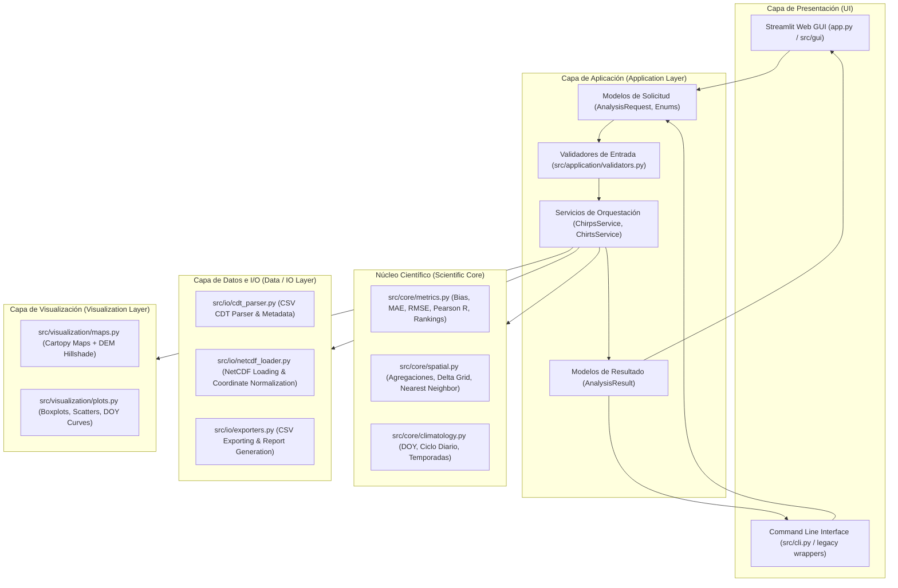

# Especificación de Arquitectura de Software

**Proyecto**: CHIRPS & CHIRTS Evaluation & Visualization Platform  
**Autor**: William Abarca  
**Afiliación**: Gerencia de Meteorología, Observatorio de Amenazas y Recursos Naturales, MARN  

---

## 1. Principios de Diseño y Objetivos

La arquitectura del sistema está concebida para transformar los scripts científicos monolíticos en una plataforma modular, desacoplada, mantenible, extensible y orientada a capas:

1. **Preservación Científica**: La lógica matemática, física y estadística se encapsula en el *Scientific Core* sin modificaciones en sus algoritmos ni tolerancias numéricas.
2. **Separación Estricta de Responsabilidades (SoC)**: La interfaz gráfica no realiza cálculos matemáticos ni manipula directamente archivos a bajo nivel.
3. **Dualidad de Entry Points**: Soporte simultáneo y completo para Interfaz Gráfica (Streamlit) y Línea de Comandos (CLI), compartiendo exactamente el mismo *Scientific Core* y *Application Layer*.
4. **Resiliencia y Validación Temprana**: Validación estricta de rutas, datos y parámetros antes de iniciar cálculos costosos.
5. **Observabilidad**: Emisión de eventos de progreso y logs contextuales consumibles tanto por la GUI como por la consola.

---

## 2. Diagrama de Capas del Sistema



---

## 3. Especificación Detallada de Capas

### 3.1. Capa de Presentación (Presentation / GUI & CLI)
- **GUI (`src/gui/` & `app.py`)**:
  - Implementada en **Streamlit** por su soporte nativo en Linux/Windows, rendimiento para visualización científica y capacidad de despliegue local o en servidor web.
  - Diseñada con módulos especializados:
    - `sidebar.py`: Configuración de producto, modos, rutas y parámetros con presets interactivos.
    - `maps_viewer.py`: Galería interactiva con visor lado a lado, $\Delta\text{GRID}$ y residuos.
    - `stations_viewer.py`: Explorador geoespacial de estaciones y mejoras de desempeño.
    - `doy_viewer.py`: Visualizador dinámico de curvas climatológicas por estación.
    - `metrics_viewer.py`: Tablas interactivas con ordenamiento y filtros de métricas estadísticas.
    - `export_viewer.py`: Centro de descargas (imágenes PNG, tablas CSV y archivo ZIP consolidado).
- **CLI (`src/cli.py` & wrappers originales)**:
  - Mantiene 100% de compatibilidad con los argumentos de `mapas_acumulados_chirps_anuales.py` y `mapas_acumulados_chirts_anuales.py`.
  - Construye una instancia de `AnalysisRequest` y ejecuta el servicio correspondiente.

### 3.2. Capa de Aplicación (Application Layer)
- **Modelos (`src/application/models.py`)**:
  - `ProductType`: `CHIRPS` (precipitación), `CHIRTS` (temperatura).
  - `ProcessingMode`: `ANNUAL`, `DAILY`, `DAILY_EVAL`, `PERIOD`.
  - `StatType`: `MEAN`, `MAX`, `MIN`, `ALL`.
  - `PeriodType`: `SEASON`, `MONTHS`.
  - `AnalysisRequest`: Dataclass que agrupa todos los parámetros requeridos para una corrida.
  - `AnalysisResult`: Dataclass que recopila archivos generados, tablas de métricas, estadísticas globales y estado de ejecución.
  - `ValidationResult`: Reporte estructurado de validación (`is_valid`, `errors`, `warnings`).
- **Validación (`src/application/validators.py`)**:
  - Comprobación de existencia y permisos de lectura/escritura en archivos y directorios.
  - Validación de compatibilidad entre producto, variables y modos.
  - Inspección previa de cabeceras de CSVs en formato CDT.
  - Verificación de consistencia en rangos de años y fechas.
- **Servicios (`src/application/services.py`)**:
  - `ChirpsService`: Orquesta la ejecución del flujo de precipitación anual y exportación.
  - `ChirtsService`: Orquesta la ejecución de los 4 modos de temperatura, gestionando paralelismo para `daily-eval` y emitiendo callbacks de progreso `(percent: float, message: str)`.

### 3.3. Núcleo Científico (Scientific Core)
- **`src/core/metrics.py`**:
  - Fórmulas puras y funciones vectorizadas con NumPy:
    $$\text{Bias} = \frac{1}{N}\sum (g_i - o_i), \quad \text{MAE} = \frac{1}{N}\sum |g_i - o_i|, \quad \text{RMSE} = \sqrt{\frac{1}{N}\sum (g_i - o_i)^2}$$
    $$\Delta\text{RMSE} = \text{RMSE}_{\text{raw}} - \text{RMSE}_{\text{corr}}, \quad \%\text{ Mejora} = 100 \times \frac{\text{RMSE}_{\text{raw}} - \text{RMSE}_{\text{corr}}}{\text{RMSE}_{\text{raw}}}$$
    $$R = \frac{\sum (o_i - \bar{o})(g_i - \bar{g})}{\sqrt{\sum (o_i - \bar{o})^2 \sum (g_i - \bar{g})^2}}$$
- **`src/core/spatial.py`**:
  - Extracción de valores de rejilla en coordenadas de estaciones mediante vecino más cercano (*nearest-neighbor*).
  - Agregación temporal celda a celda (`sum`, `mean`, `max`, `min`).
  - Cálculo de campos continuos de anomalía $\Delta\text{GRID}$.
  - Sombreado de relieve (*hillshade*) usando `matplotlib.colors.LightSource`.
- **`src/core/climatology.py`**:
  - Definición de temporadas climáticas (`DJFM`, `A`, `MJJ`, `ASO`, `N`) y manejo de cruce de año.
  - Cálculo de ciclos climatológicos diarios DOY ($d \in [1, 365]$) con media, máximo, mínimo y desviación estándar ($\sigma$).

### 3.4. Capa de Datos e I/O (Data / IO Layer)
- **`src/io/cdt_parser.py`**:
  - Lectura robusta de CSVs formato CDT (metadatos de 4 filas + serie temporal), conversión a formato largo (*tidy data*), y sustitución de valores nulos o faltantes (`-99`, `NA`, `""`).
- **`src/io/netcdf_loader.py`**:
  - Descubrimiento y carga de NetCDFs individuales o por lotes con Xarray/netCDF4.
  - Normalización automática de dimensiones espaciales (`lon`/`lat`).
- **`src/io/exporters.py`**:
  - Generación estandarizada de CSVs de salida, resúmenes globales, métricas por estación y rankings ordenados.

### 3.5. Capa de Visualización (Visualization Layer)
- **`src/visualization/maps.py`**:
  - Mapas con `cartopy.crs.PlateCarree`, relieve DEM sombreado, capas geopolíticas (costas, fronteras, ríos, lagos, divisiones administrativas) y ajuste de etiquetas con `adjustText`.
- **`src/visualization/plots.py`**:
  - Gráficos estadísticos con estilos formales: boxplots afinados con jitter, scatter plots con línea 1:1 y regresión lineal, series de evolución temporal de RMSE y curvas DOY tripanel.

---

## 4. Estructura de Directorios Propuesta

```
src/
├── __init__.py
├── cli.py                         # Entrada unificada CLI
├── config/
│   ├── __init__.py
│   ├── constants.py               # Constantes científicas, temporadas, estilos, colores
│   └── settings.py                # Configuración de rutas y variables de entorno
├── core/
│   ├── __init__.py
│   ├── metrics.py                 # Fórmulas de error, correlación y rankings
│   ├── spatial.py                 # Agregaciones espaciales, delta grid y hillshade
│   └── climatology.py             # DOY, temporadas climáticas y fechas
├── io/
│   ├── __init__.py
│   ├── cdt_parser.py              # Parser de CSV CDT
│   ├── netcdf_loader.py           # Cargador y normalizador NetCDF
│   └── exporters.py               # Escritura de resultados CSV y tablas
├── visualization/
│   ├── __init__.py
│   ├── maps.py                    # Mapas cartográficos con Cartopy
│   └── plots.py                   # Gráficos estadísticos y curvas DOY
├── application/
│   ├── __init__.py
│   ├── models.py                  # Dataclasses de Request, Result, Enums
│   ├── validators.py              # Validadores de datos y parámetros
│   └── services.py                # Orquestadores de flujos CHIRPS y CHIRTS
└── gui/
    ├── __init__.py
    ├── app.py                     # Punto de entrada de la interfaz Streamlit
    └── components/
        ├── __init__.py
        ├── sidebar.py             # Panel de configuración y validación
        ├── maps_viewer.py         # Pestaña de mapas y comparaciones
        ├── stations_viewer.py     # Pestaña de análisis en estaciones
        ├── doy_viewer.py          # Pestaña de climatología DOY
        ├── metrics_viewer.py      # Pestaña de tablas estadísticas y rankings
        └── export_viewer.py       # Pestaña de descargas y exportaciones
```
