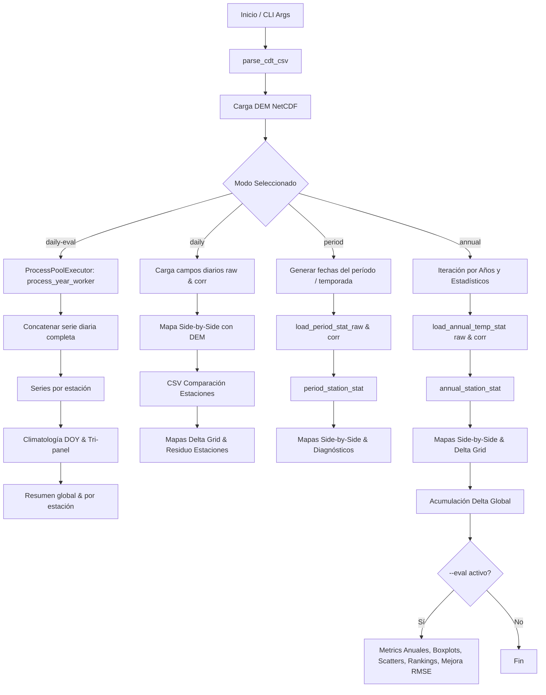

# Auditoría del Repositorio: CHIRPS & CHIRTS Evaluation Toolkit

**Fecha de auditoría**: 2026-09-08  
**Autor del proyecto original**: William Abarca  
**Afiliación**: Gerencia de Meteorología, Observatorio de Amenazas y Recursos Naturales, Ministerio de Medio Ambiente y Recursos Naturales (MARN), El Salvador  
**Contacto**: abarca.will@gmail.com  

---

## 1. Descripción del Proyecto

El repositorio contiene un conjunto de herramientas y algoritmos científicos desarrollados en Python para la **evaluación, comparación y visualización** de productos grillados de precipitación y temperatura (CHIRPS y CHIRTS) en su versión original versus su versión corregida (mediante la metodología CDT - Climate Data Tool del IRI / Columbia University), utilizando observaciones de estaciones meteorológicas terrestres.

La suite permite:
- Generar mapas comparativos lado a lado (original vs. corregido) con escalas continuas y discretas.
- Integrar modelos digitales de elevación (DEM / GEBCO) para generar relieve sombreado (*hillshade*).
- Extraer valores grillados en las ubicaciones de estaciones mediante vecino más cercano (*nearest-neighbor*).
- Calcular métricas estadísticas de desempeño: Sesgo (*Bias*), Error Absoluto Medio (*MAE*), Raíz del Error Cuadrático Medio (*RMSE*), Coeficiente de Correlación de Pearson ($R$), Diferencia de RMSE ($\Delta\text{RMSE}$) y Mejora Porcentual ($\%\text{ Mejora}$).
- Construir series temporales diarias completas y ciclos anuales climatológicos por día del año (*DOY - Day of Year*) por estación con envolventes de variabilidad ($\pm 1\sigma$).
- Generar productos de diagnóstico: diferencias espaciales $\Delta\text{GRID}$, residuos $(\text{Corr} - \text{Obs})$, rankings de estaciones, diagramas de dispersión (*scatter plots*) y diagramas de caja (*boxplots*).

---

## 2. Estructura Actual del Repositorio

```
.
├── .gitignore
├── README.md                                  # Documentación general y fórmulas
├── environment.yml                            # Definición de entorno Conda/Mamba
├── requirements.txt                           # Dependencias Pip
├── mapas_acumulados_chirps_anuales.py         # Script científico para CHIRPS (precipitación)
├── mapas_acumulados_chirts_anuales.py         # Script científico para CHIRTS (temperatura)
└── DATA/
    ├── centroamerica/
    │   ├── cdt_corrected_data/                # NetCDFs diarios corregidos (pr, tmax, tmin)
    │   ├── cdt_original_data/                 # NetCDFs diarios originales
    │   ├── cdt_evaluation_results/            # Resultados de evaluación previos
    │   └── datos/
    │       ├── dem/                           # Modelos digitales de elevación (gebco_2024.nc)
    │       ├── gridded_data/                  # Rejillas adicionales
    │       └── station_data/                  # Observaciones de estaciones en formato CDT (.csv)
    └── el_salvador/
        ├── CHIRPSv2/
        ├── CHIRTS/
        ├── Datos/
        └── Shapefile/                         # Archivos vectoriales de delimitación
```

---

## 3. Función de Cada Script

### A. `mapas_acumulados_chirps_anuales.py` (522 líneas)
- **Objetivo**: Evaluación y generación de mapas de precipitación acumulada anual.
- **Entradas**: CSV de estaciones CDT con precipitación diaria, directorio de NetCDFs CHIRPS originales (`precip_YYYYMMDD.nc`), directorio de NetCDFs CHIRPS corregidos (`precip_mrg_YYYYMMDD.nc`).
- **Procesamiento**:
  - Parseo del formato CDT con metadatos de estaciones.
  - Suma anual diaria de precipitaciones celda por celda para grillas originales y corregidas (controlando datos faltantes `-99`).
  - Agregación anual observada en estaciones.
  - Gráficos lado a lado con `cartopy` y `matplotlib` en proyección PlateCarree con escala fija (0–3000 mm).
- **Salidas**: Mapas PNG en `<out>/mapas_anuales/acumulado_anual_YYYY.png` y CSVs de acumulados observados en estaciones.

### B. `mapas_acumulados_chirts_anuales.py` (5,720 líneas)
- **Objetivo**: Evaluación exhaustiva y generación de mapas de temperatura (`tmax`, `tmin`) con relieve DEM y múltiples modalidades operativas.
- **Modos de Operación**:
  1. `annual`: Bucle por años y estadísticas (`mean`, `max`, `min`), mapas lado a lado con hillshade DEM, mapas $\Delta\text{GRID}$ anuales y globales, CSVs de comparación por estación. Si se activa `--eval`: métricas anuales (Bias, MAE, RMSE, R), gráficos de barras de RMSE, boxplots de errores, scatter plots, rankings de estaciones, mapas de mejora $\Delta\text{RMSE}$ y residuos.
  2. `daily`: Evaluación para una fecha puntual (`--date YYYY-MM-DD`), mapa lado a lado, CSV de comparación, mapa $\Delta\text{GRID}$ de campo, mapa $\Delta\text{GRID}$ en estaciones y mapa de residuo en estaciones.
  3. `daily-eval`: Construcción en paralelo (`ProcessPoolExecutor`) de la serie temporal diaria completa de todos los años disponibles, exportación de series globales y por estación, cálculo de climatología diaria DOY (1–365) con gráficos individuales y tripanel (`mean`, `max`, `min` con sombreado $\pm 1\sigma$), y resúmenes diarios globales y por estación.
  4. `period`: Evaluación para períodos específicos basados en estaciones climáticas (`DJFM`, `A`, `MJJ`, `ASO`, `N`, o `--all-seasons`) o meses arbitrarios (ej. `5,6,7`), generando mapas agregados, comparaciones en estaciones y productos de diagnóstico.

---

## 4. Flujo de Ejecución



---

## 5. Entradas y Parámetros

| Parámetro | Tipo | Descripción | Obligatorio / Modos |
|---|---|---|---|
| `--csv` | Ruta | Archivo CSV en formato CDT con observaciones y metadatos (IDs, lon, lat, elev, fechas). | Obligatorio en todos |
| `--dir-chirts` / `--dir-chirps` | Ruta | Directorio con NetCDFs diarios de producto original (`temp_YYYYMMDD.nc` o `precip_YYYYMMDD.nc`). | Obligatorio en todos |
| `--prefix-chirts` | String | Prefijo de archivos originales (default: `"temp_"`). | Opcional |
| `--dir-merged` | Ruta | Directorio con NetCDFs de producto corregido (`*_mrg_YYYYMMDD.nc`). | Obligatorio en todos |
| `--var` | String | Variable a procesar: `tmax` o `tmin` (CHIRTS) / `precip` (CHIRPS). | Obligatorio |
| `--stat` | String | Estadístico: `mean`, `max`, `min`, `all`. | Modos annual, period |
| `--dem` | Ruta | NetCDF con modelo digital de elevación y coordenadas lat/lon. | CHIRTS |
| `--out` | Ruta | Directorio base de salida (default: `./salidas`). | Opcional |
| `--yini`, `--yend` | Entero | Rango de años a procesar. | Annual, Period |
| `--extent` | Float x 4 | Extensión geográfica: `xmin xmax ymin ymax`. | Opcional |
| `--mode` | String | Modo: `annual`, `daily`, `daily-eval`, `period`. | CHIRTS (default: annual) |
| `--period-type` | String | Tipo de período: `season` o `months`. | Modo period |
| `--season` | String | Temporada: `DJFM`, `A`, `MJJ`, `ASO`, `N`. | Modo period season |
| `--all-seasons` | Flag | Procesa todas las temporadas definidas. | Modo period season |
| `--months` | String | Lista de meses (ej: `5,6,7`). | Modo period months |
| `--eval` | Flag | Activa generación de métricas, rankings, boxplots y scatters. | Modo annual, period |
| `--date` | String | Fecha específica (`YYYY-MM-DD`). | Obligatorio en modo daily |

---

## 6. Salidas Generadas

1. **Mapas Cartográficos (PNG)**:
   - Mapas lado a lado (*Side-by-Side*) CHIRPS/CHIRTS Original vs. Corregido con estaciones y relieve DEM.
   - Mapas de campo $\Delta\text{GRID} = \text{Corregido} - \text{Original}$ con escala divergente `RdBu_r`.
   - Mapas de $\Delta\text{GRID}$ en estaciones con etiquetas de texto sin solapamiento.
   - Mapas de residuo en estaciones $(\text{Grid}_{\text{corr}} - \text{Obs})$.
   - Mapas de mejora relativa de RMSE ($\%\Delta\text{RMSE}$) en estaciones.
2. **Gráficos Estadísticos (PNG)**:
   - Curvas de Climatología DOY por estación (paneles individuales y tri-panel `mean`/`max`/`min` con banda $\pm 1\sigma$).
   - Gráficos de barras de evolución temporal del RMSE.
   - Boxplots de error absoluto por estación (globales y por año).
   - Boxplots de mejora porcentual de RMSE.
   - Diagramas de dispersión (*Scatter plots*) Observado vs. Grilla (Original vs. Corregido) con línea 1:1 y correlación $R$.
   - Diagramas de dispersión RMSE Original vs. RMSE Corregido y RMSE Original vs. $\%$ Mejora con regresión lineal.
3. **Tablas de Datos y Métricas (CSV)**:
   - Series diarias completas (`daily_timeseries_<var>_1991_2020.csv`) y por estación (`daily_timeseries_<var>_station_<id>.csv`).
   - Ciclos climatológicos diarios (`clim_doy_<var>_station_<id>.csv`).
   - Comparaciones directas por estación y fecha (`<nombre>_cmp_estaciones.csv`).
   - Resúmenes globales diarios (`summary_daily_global_<var>.csv`) y por estación (`summary_daily_by_station_<var>.csv`).
   - Tablas de métricas anuales (`metrics_annual_<var>_<stat>.csv`).
   - Rankings de estaciones ordenados por $\Delta\text{RMSE}$ (globales y por año).
   - Tablas de mejora por estación (`improvement_stations_<var>_<stat>_<label>_RMSE.csv`).

---

## 7. Dependencias Identificadas

- `python>=3.10`
- `numpy`: Cálculos matriciales, estadísticas, manejo de NaNs.
- `pandas`: Manipulación tabular, agregaciones `groupby`, series temporales.
- `xarray`: Manejo de datasets multidimensionales NetCDF.
- `netCDF4`: Backend para lectura/escritura de archivos NetCDF.
- `matplotlib`: Generación y formateo fino de figuras, subplots, boxplots, scatters, gridspec.
- `cartopy`: Proyecciones geoespaciales (`PlateCarree`), líneas de costa, fronteras, ríos, lagos y divisiones administrativas.
- `adjustText`: Ajuste automático de etiquetas en mapas para evitar solapamientos.

---

## 8. Funciones Reutilizables Identificadas

| Función Original | Propósito | Destino en Arquitectura Modular |
|---|---|---|
| `parse_cdt_csv` | Lectura y desanidado del formato CDT con metadatos | `src/io/cdt_parser.py` |
| `_rename_coords_latlon` | Normalización de nombres de coordenadas a `lon`/`lat` | `src/io/netcdf_loader.py` |
| `load_daily_chirts_raw` / `load_daily_chirts_corr` | Carga de campos diarios NetCDF | `src/io/netcdf_loader.py` |
| `load_daily_sum_for_year` | Acumulación anual de campos diarios de precipitación | `src/core/spatial.py` |
| `load_annual_temp_stat` / `load_period_stat_*` | Agregación temporal de campos grillados | `src/core/spatial.py` |
| `compute_metrics` | Cálculo de Bias, MAE, RMSE | `src/core/metrics.py` |
| `summarize_daily_global` / `summarize_daily_by_station` | Agregación de métricas de series completas | `src/core/metrics.py` |
| `compute_annual_metrics_from_csv` | Métricas anuales y correlación Pearson | `src/core/metrics.py` |
| `compute_station_metrics_global` / `compute_station_metrics_from_csv` | Rankings de estaciones | `src/core/metrics.py` |
| `compute_climatology_doy_by_station` | Cálculo de ciclo climatológico diario | `src/core/climatology.py` |
| `get_dates_for_period` / `make_period_title` | Generación de fechas y etiquetas para temporadas/meses | `src/core/climatology.py` |
| `plot_side_by_side` | Renderizado de mapa comparativo con DEM | `src/visualization/maps.py` |
| `plot_delta_grid_field` | Renderizado de campo continuo $\Delta\text{GRID}$ | `src/visualization/maps.py` |
| `plot_delta_grid_at_stations` | Renderizado de puntos $\Delta\text{GRID}$ | `src/visualization/maps.py` |
| `plot_residual_corr_at_stations_with_dem` | Renderizado de residuos en estaciones con DEM | `src/visualization/maps.py` |
| `plot_improvement_at_stations_with_dem` | Renderizado de mejora de RMSE en estaciones | `src/visualization/maps.py` |
| `plot_climatology_doy_station*` | Gráficos de climatología DOY simple y tri-panel | `src/visualization/plots.py` |
| `plot_boxplot_*` | Gráficos de boxplot para errores y mejoras | `src/visualization/plots.py` |
| `plot_scatter_*` | Gráficos de dispersión OBS vs Grilla y RMSE vs Mejora | `src/visualization/plots.py` |
| `plot_rmse_bars` | Gráfico de evolución temporal del RMSE | `src/visualization/plots.py` |

---

## 9. Acoplamientos y Problemas Encontrados

1. **Acoplamiento Directo CLI-Procesamiento**: El bloque `main()` en ambos scripts contiene toda la orquestación, bucles de directorios y llamadas gráficas entrelazadas, impidiendo la invocación programática limpia desde una GUI.
2. **Dependencia de Rutas Hard-Coded**: Rutas específicas en ejemplos y scripts auxiliares en carpetas de datos.
3. **Manejo de Memoria en Procesamiento Multianual**: La carga de cientos de NetCDFs diarios en bucles sin liberar datasets de xarray (`ds.close()`) o reutilizar DataArrays puede aumentar el uso de RAM.
4. **Falta de Validación Previa Estructurada**: Errores en nombres de archivo, fechas fuera de rango o columnas faltantes en CSV producen tracebacks crudos en lugar de mensajes amigables al usuario.
5. **Generación Gráfica Bloqueante**: La generación de decenas de figuras en matplotlib es intensiva en CPU. Para una GUI web es crítico tener callbacks de progreso y separar la ejecución en hilos o procesos controlados.

---

## 10. Riesgos Técnicos y Científicos

- **Riesgo Científico**: Modificar inadvertidamente las fórmulas de cálculo de anomalías, métricas de error (Bias, MAE, RMSE, Pearson $R$), ponderación de valores faltantes (`-99`), o extracción espacial por vecino más cercano.
  - *Mitigación*: Pruebas de regresión numérica estricta comparando directamente las funciones refactorizadas contra las implementaciones originales (`assert_allclose`).
- **Riesgo Técnico**: Incompatibilidad de fuentes tipográficas (`Calibri` vs. `DejaVu Sans`) o dependencias de `cartopy` y `GEOS`/`PROJ` en entornos limpios.
  - *Mitigación*: Fallbacks robustos en `src/config/constants.py` y configuración portable de `cartopy`.

---

## 11. Oportunidades de Refactorización

1. **Separación Limpia de Capas**: GUI $\rightarrow$ Application Layer $\rightarrow$ Scientific Core $\rightarrow$ Data/IO.
2. **Modelado con Dataclasses / Enums**: Creación de `AnalysisRequest` y `AnalysisResult` para tipar estrictamente los parámetros de análisis.
3. **Capa de Validación Reutilizable**: `src/application/validators.py` para validar entradas tanto en GUI como en CLI antes de cualquier cómputo costoso.
4. **Callbacks de Progreso Unificados**: Mecanismo de notificación desacoplado para alimentar barras de progreso en Streamlit o barras en CLI.
5. **Dashboard Web Interactivo (Streamlit)**: Selector intuitivo de datos, visor dinámico de mapas, explorador de series DOY por estación, tablas filtrables de métricas y descarga en un solo clic de reportes e imágenes.
